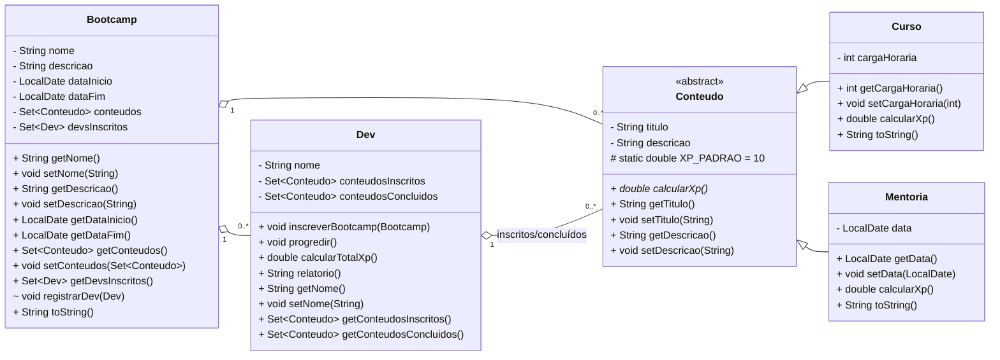

# Desafio 01 – POO na Prática (DIO) • Java 11

Modelagem completa do **domínio de um Bootcamp** usando os 4 pilares da POO:
**Abstração, Encapsulamento, Herança e Polimorfismo**.  
Classes principais: `Conteudo` (abstrata) → `Curso` e `Mentoria`; `Bootcamp` agrega conteúdos e devs; `Dev` progride e acumula XP.

> Projeto preparado para **Maven + JUnit** e pronto para **rodar/avaliar** com um comando.

---

## 🚀 Como executar

```bash
# testes
mvn -q clean test

# rodar exemplo principal
mvn -q compile exec:java
```

Saída esperada (exemplo):

```
Bootcamp{nome='Bootcamp GTF – Back-End com Java', inicio=2025-09-04, fim=2025-10-19, conteudos=3, devsInscritos=2}
----
Dev{Nay Rodrigues}
- Inscritos: [Mentoria{titulo='Mentoria de carreira', descricao='Estratégia de portfólio e GitHub', data=2025-09-06}]
- Concluídos: [Curso{titulo='Java POO – Abstração/Encapsulamento', descricao='Modelando domínio de Bootcamp', cargaHoraria=8h}, Curso{titulo='API REST com Spring', descricao='CRUD + JPA + validação', cargaHoraria=10h}]
- XP total: 180.0
----
Dev{João Silva}
- Inscritos: [Curso{titulo='API REST com Spring', descricao='CRUD + JPA + validação', cargaHoraria=10h}, Mentoria{titulo='Mentoria de carreira', descricao='Estratégia de portfólio e GitHub', data=2025-09-06}]
- Concluídos: [Curso{titulo='Java POO – Abstração/Encapsulamento', descricao='Modelando domínio de Bootcamp', cargaHoraria=8h}]
- XP total: 80.0
```

---

## 🧩 Estrutura e Pilares

- **Abstração:** `Conteudo` define a interface comum (`calcularXp()`), escondendo detalhes de `Curso`/`Mentoria`.
- **Encapsulamento:** atributos privados + getters/setters, `registrarDev` com visibilidade de pacote para controle interno.
- **Herança:** `Curso` e `Mentoria` estendem `Conteudo`.
- **Polimorfismo:** `Dev.calcularTotalXp()` opera sobre `Conteudo` (super-tipo), invocando `calcularXp()` concreto de cada subclasse.

---

## 🗂️ Pacotes

```
br.com.nayrodrigues.dio.poo
 ├─ Main.java
 ├─ dominio/
 │   ├─ Bootcamp.java
 │   ├─ Conteudo.java       # abstrata
 │   ├─ Curso.java          # herda Conteudo
 │   ├─ Mentoria.java       # herda Conteudo
 │   └─ Dev.java
 └─ util/
     └─ DateUtils.java
```

---

## 🧪 Testes (JUnit 5)

- `DevTest#calculaXpAoProgredir` valida progressão e soma de XP (curso + mentoria).
- Rode com `mvn test`.

---

## 🔎 Diagrama UML

> Compatível com **Mermaid** (renderiza no GitHub).  
> Se preferir, copie o bloco abaixo para `docs/diagram.md`.


