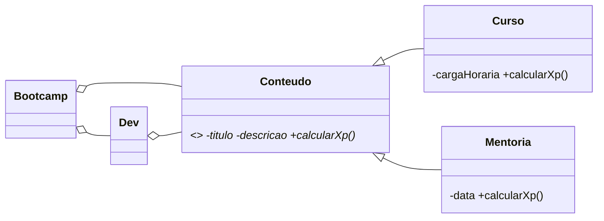

```mermaid
classDiagram
    direction LR
    class Conteudo { <<abstract>> -titulo -descricao +calcularXp()* }
    class Curso { -cargaHoraria +calcularXp() }
    class Mentoria { -data +calcularXp() }
    class Bootcamp
    class Dev
    Conteudo <|-- Curso
    Conteudo <|-- Mentoria
    Bootcamp o-- Conteudo
    Bootcamp o-- Dev
    Dev o-- Conteudo
```
